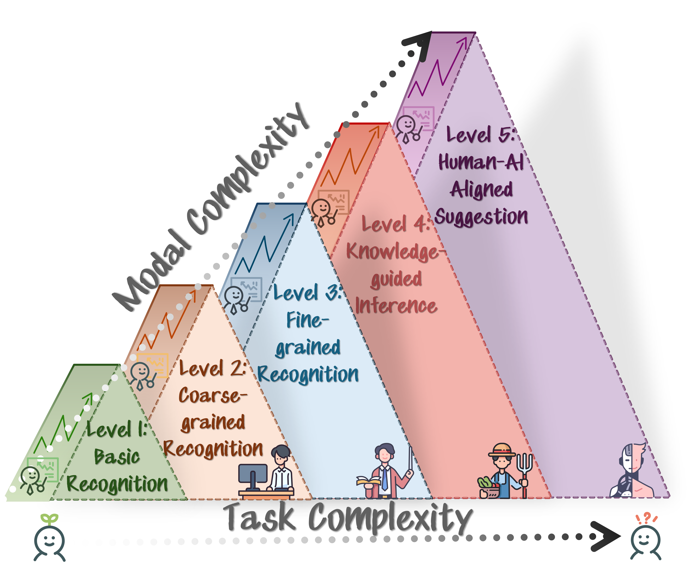
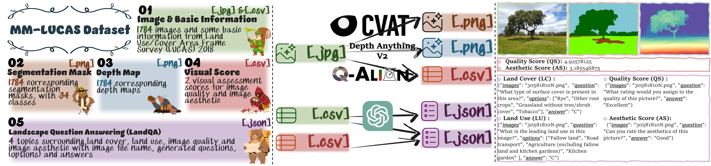

 

## <p align=center>AgriBench: A Hierarchical Agriculture Benchmark for Multimodal Large Language Models<p>
<div align=center>
<p>
  
[![Dataset Download](https://img.shields.io/badge/Dataset-Download-90B44B?logo=data:image/svg%2bxml;base64,PHN2ZyBpZD0iTGF5ZXJfMSIgZW5hYmxlLWJhY2tncm91bmQ9Im5ldyAwIDAgNTEwIDUxMCIgaGVpZ2h0PSI1MTIiIHZpZXdCb3g9IjAgMCA1MTAgNTEwIiB3aWR0aD0iNTEyIiB4bWxucz0iaHR0cDovL3d3dy53My5vcmcvMjAwMC9zdmciPjxnPjxnPjxwYXRoIGQ9Im0xNzQuNjEgMzAwYy0yMC41OCAwLTQwLjU2IDYuOTUtNTYuNjkgMTkuNzJsLTExMC4wOSA4NS43OTd2MTA0LjQ4M2g1My41MjlsNzYuNDcxLTY1aDEyNi44MnYtMTQ1eiIgZmlsbD0iI2ZmZGRjZSIvPjwvZz48cGF0aCBkPSJtNTAyLjE3IDI4NC43MmMwIDguOTUtMy42IDE3Ljg5LTEwLjc4IDI0LjQ2bC0xNDguNTYgMTM1LjgyaC03OC4xOHYtODVoNjguMThsMTE0LjM0LTEwMC4yMWMxMi44Mi0xMS4yMyAzMi4wNi0xMC45MiA0NC41LjczIDcgNi41NSAxMC41IDE1LjM4IDEwLjUgMjQuMnoiIGZpbGw9IiNmZmNjYmQiLz48cGF0aCBkPSJtMzMyLjgzIDM0OS42M3YxMC4zN2gtNjguMTh2LTYwaDE4LjU1YzI3LjQxIDAgNDkuNjMgMjIuMjIgNDkuNjMgNDkuNjN6IiBmaWxsPSIjZmZjY2JkIi8+PHBhdGggZD0ibTM5OS44IDc3LjN2OC4wMWMwIDIwLjY1LTguMDQgNDAuMDctMjIuNjQgNTQuNjdsLTExMi41MSAxMTIuNTF2LTIyNi42NmwzLjE4LTMuMTljMTQuNi0xNC42IDM0LjAyLTIyLjY0IDU0LjY3LTIyLjY0IDQyLjYyIDAgNzcuMyAzNC42OCA3Ny4zIDc3LjN6IiBmaWxsPSIjZDAwMDUwIi8+PHBhdGggZD0ibTI2NC42NSAyNS44M3YyMjYuNjZsLTExMi41MS0xMTIuNTFjLTE0LjYtMTQuNi0yMi42NC0zNC4wMi0yMi42NC01NC42N3YtOC4wMWMwLTQyLjYyIDM0LjY4LTc3LjMgNzcuMy03Ny4zIDIwLjY1IDAgNDAuMDYgOC4wNCA1NC42NiAyMi42NHoiIGZpbGw9IiNmZjRhNGEiLz48cGF0aCBkPSJtMjEyLjgzIDM2MC4xMnYzMGg1MS44MnYtMzB6IiBmaWxsPSIjZmZjY2JkIi8+PHBhdGggZD0ibTI2NC42NSAzNjAuMTJ2MzBoMzYuMTRsMzIuMDQtMzB6IiBmaWxsPSIjZmZiZGE5Ii8+PC9nPjwvc3ZnPg==)](https://drive.google.com/drive/folders/11aKHbTvTzj9ciFDHjiGwuc1ggtZVmAyY?usp=sharing)
[![Paper Download](https://img.shields.io/badge/Paper-Download-90B44B?logo=data:image/svg%2bxml;base64,PHN2ZyBpZD0iTGF5ZXJfMSIgZW5hYmxlLWJhY2tncm91bmQ9Im5ldyAwIDAgNTEwIDUxMCIgaGVpZ2h0PSI1MTIiIHZpZXdCb3g9IjAgMCA1MTAgNTEwIiB3aWR0aD0iNTEyIiB4bWxucz0iaHR0cDovL3d3dy53My5vcmcvMjAwMC9zdmciPjxnPjxnPjxwYXRoIGQ9Im0xNzQuNjEgMzAwYy0yMC41OCAwLTQwLjU2IDYuOTUtNTYuNjkgMTkuNzJsLTExMC4wOSA4NS43OTd2MTA0LjQ4M2g1My41MjlsNzYuNDcxLTY1aDEyNi44MnYtMTQ1eiIgZmlsbD0iI2ZmZGRjZSIvPjwvZz48cGF0aCBkPSJtNTAyLjE3IDI4NC43MmMwIDguOTUtMy42IDE3Ljg5LTEwLjc4IDI0LjQ2bC0xNDguNTYgMTM1LjgyaC03OC4xOHYtODVoNjguMThsMTE0LjM0LTEwMC4yMWMxMi44Mi0xMS4yMyAzMi4wNi0xMC45MiA0NC41LjczIDcgNi41NSAxMC41IDE1LjM4IDEwLjUgMjQuMnoiIGZpbGw9IiNmZmNjYmQiLz48cGF0aCBkPSJtMzMyLjgzIDM0OS42M3YxMC4zN2gtNjguMTh2LTYwaDE4LjU1YzI3LjQxIDAgNDkuNjMgMjIuMjIgNDkuNjMgNDkuNjN6IiBmaWxsPSIjZmZjY2JkIi8+PHBhdGggZD0ibTM5OS44IDc3LjN2OC4wMWMwIDIwLjY1LTguMDQgNDAuMDctMjIuNjQgNTQuNjdsLTExMi41MSAxMTIuNTF2LTIyNi42NmwzLjE4LTMuMTljMTQuNi0xNC42IDM0LjAyLTIyLjY0IDU0LjY3LTIyLjY0IDQyLjYyIDAgNzcuMyAzNC42OCA3Ny4zIDc3LjN6IiBmaWxsPSIjZDAwMDUwIi8+PHBhdGggZD0ibTI2NC42NSAyNS44M3YyMjYuNjZsLTExMi41MS0xMTIuNTFjLTE0LjYtMTQuNi0yMi42NC0zNC4wMi0yMi42NC01NC42N3YtOC4wMWMwLTQyLjYyIDM0LjY4LTc3LjMgNzcuMy03Ny4zIDIwLjY1IDAgNDAuMDYgOC4wNCA1NC42NiAyMi42NHoiIGZpbGw9IiNmZjRhNGEiLz48cGF0aCBkPSJtMjEyLjgzIDM2MC4xMnYzMGg1MS44MnYtMzB6IiBmaWxsPSIjZmZjY2JkIi8+PHBhdGggZD0ibTI2NC42NSAzNjAuMTJ2MzBoMzYuMTRsMzIuMDQtMzB6IiBmaWxsPSIjZmZiZGE5Ii8+PC9nPjwvc3ZnPg==)](xxx)
[](https://hits.seeyoufarm.com)

</p>
</div>

##  Contents

* [**News**](#head1)
* [**Overview**](#head2)
* [**The 5 Levels Evaluation Strategy**](#head3)
* [**MM-LUCAS Dataset**](#head4)
* [**Citation**](#head5)

##  To Do
* - [x] Public MM-LUCAS dataset and update initial repo.
* - [ ] Add quantitative evaluation results.
* - [ ] Add Leaderboard.


## <span id="head1">  News </span>
* [08/2024] AgriBench is accepted by [9th Computer Vision in Plant Phenotyping and Agriculture (CVPPA 2024)](https://cvppa2024.github.io/) @ECCV 2024. 

## <span id="head2">  Overview </span>

## <span id="head3">  The 5 Levels Evaluation Strategy </span>
 

## <span id="head4">  MM-LUCAS Dataset </span>

 

| Content | Size | Files | Format | Details
| :--- |  :----:  |  :----: | :----: | :----------
| [🍀MM-LUCAS](https://drive.google.com/drive/folders/11aKHbTvTzj9ciFDHjiGwuc1ggtZVmAyY?usp=sharing) | - | 7,141 | | Main Folder
| &boxvr;&nbsp; 1_images | 877 MB | 1,784 | JPG | Scenery images (1600&times;1200 pixels) <[Ref](https://www.sciencedirect.com/science/article/pii/S2352340924003639?via%3Dihub)>
| &boxvr;&nbsp; 2_seg | 18.0 MB | 1,784 | PNG | Segmentation masks <[Ref](https://www.sciencedirect.com/science/article/pii/S2352340924003639?via%3Dihub)>
| &boxvr;&nbsp; 2_seg_color | 24.0 MB | 1,784 | PNG | Color-coded segmentation masks
| &boxvr;&nbsp; 3_depth | 619 MB | 1,784 | PNG | Depth images <from [Depth Anything V2-Large](https://github.com/DepthAnything/Depth-Anything-V2)>
| &boxvr;&nbsp; 4_mm_lucas | 348 KB | 1 | CSV | Microdata (File name, Quality score <from [Q-Align](https://github.com/Q-Future/Q-Align)>, Aesthetic score <from [Q-Align](https://github.com/Q-Future/Q-Align)>, Geographical location, Country, Date, Land cover, Land use, Classes.) 
| &boxvr;&nbsp; 5_aesthetics_score | 264 KB | 1 | JSON | Single question-answering: {*"images:", "questions:", "answer:"*}
| &boxvr;&nbsp; 5_land_cover | 559 KB | 1 | JSON | Multi-choice question-answering: {*"images:", "questions:", "options:", "answer:"*}
| &boxvr;&nbsp; 5_land_use | 615 KB | 1 | JSON | Multi-choice question-answering: {*"images:", "questions:", "options:", "answer:"*}
| &boxvr;&nbsp; 5_quality_score | 267 KB | 1 | JSON | Single question-answering: {*"images:", "questions:", "answer:"*}

## <span id="head5">  Citation </span>

If you find this paper and repo helpful for your research, please consider citing our paper:

```bibtex

TBA

```
 
